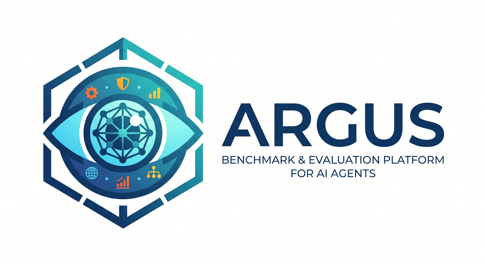
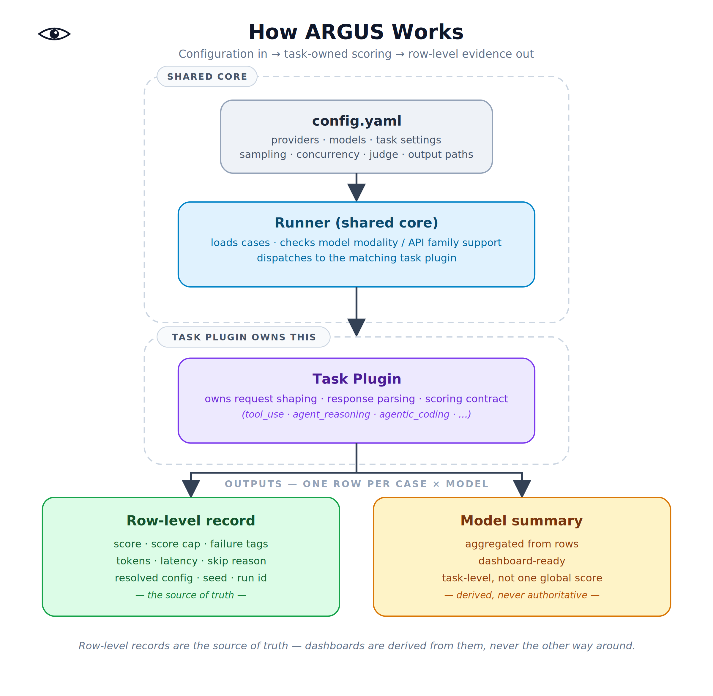

<p align="center">
  
</p>

<h1 align="center">ARGUS</h1>

<p align="center">
  <b>An open-source benchmark and evaluation platform for AI agents.</b><br/>
  Measure reasoning, planning, tool use, reliability, safety, cost, and real-world task performance.
</p>

<p align="center">
  <a href="https://github.com/leluong141996-dev/Argus?tab=readme-ov-file#"></a>
  
  
  
</p>

---

> **Project status (alpha).** Today the repo ships one complete vertical slice —
> pipeline-style scoring and the reference `agent_reasoning` plugin. The CLI,
> config layer, provider adapters, additional plugins, trust machinery
> (baselines/gates/datasets), and the web dashboard described below are the
> *target* design and are still being built. See [`docs/ROADMAP.md`](./docs/ROADMAP.md)
> for exactly what exists versus what is planned.

## Why ARGUS

Public leaderboards are good at telling you which model *looks* strong. They are not good at catching the quiet failures that break production systems: a right-shaped SQL query that quietly swaps the metric, a tool call that picks the right tool but drifts on parameters, an agent that cites every piece of evidence instead of only what supports its claim, or a coding patch that passes every visible test while breaking an invariant nobody wrote a test for.

**ARGUS exists to catch the plausible-but-wrong answer, not just the obviously-wrong one.**

It is a configurable evaluation harness for AI agents and models. It runs providers through **task plugins**, each with its own scoring contract, records one row per case/model pair, and scores with deterministic checkers or LLM judges depending on what the task actually needs. ARGUS treats evaluation like software: versioned, baseline-tested, gated, and built so failure modes are visible enough for a team to debug — not just a leaderboard number.

## Core philosophy

1. **Cases should be realistic, not generic.** Good eval cases include distractors, stale context, ambiguous evidence, and the boundary conditions that make real work hard — without depending on real production data. Synthetic and redacted cases keep the *shape* of the difficulty without exposing the underlying system.
2. **Score the contract, not the vibe.** LLM judges are reserved for genuinely open-ended tasks. Wherever a task has a checkable contract — a schema, a canonical tool signature, a set of valid evidence IDs, a test suite — ARGUS scores it deterministically. A fluent answer that violates the contract should not get credit.
3. **Make shortcuts visible.** Every task ships with adversarial baselines — empty output, schema-only output, cite-everything output, no-op agents, reference agents — that exist to break the scorer, not to pad a leaderboard. If a shortcut baseline can pass, the eval isn't ready.

## How it works
<p align="center">
  
</p>

The harness itself is intentionally boring: it loads config, checks compatibility, calls a plugin, writes a record. All the interesting behavior — what counts as correct, what counts as a shortcut, how to score it — lives inside the task plugin. Adding a new benchmark surface means writing a new plugin, not touching the core.

## Task plugins

| Plugin | What the contract protects | Scoring |
|---|---|---|
| `query_generation` | Metric intent and schema intent under paraphrase/pressure | LLM judge (business intent is open-ended) |
| `tool_use` | Canonical tool selection and parameter correctness | Deterministic |
| `multimodal_matching` | Constrained decisions over paired multimodal input | Deterministic (exact label match) |
| `agent_reasoning` | Grounded claims, evidence faithfulness, calibrated confidence, safe actions | Deterministic (schema validity, claim correctness, evidence ID faithfulness, calibration, action quality, safety) |
| `agentic_coding` | Repository-level behavior beyond visible tests | Visible + hidden tests, hard-failure gates, anti-gaming checks |

Each plugin defines:
- **Case format** — the input contract (e.g. a synthetic evidence ledger, a repo diff task, a tool-call context).
- **Ontology / contract** — the set of valid claims, tools, labels, or invariants a correct answer must respect.
- **Scorer** — deterministic checks where possible, LLM judge only where the task is genuinely open-ended.
- **Baselines** — shortcut strategies the scorer must correctly reject.

### Example: `agent_reasoning`

Each case is a synthetic evidence ledger (events, actions, noise, distractors) with no real user data. The agent must return strict, schema-valid output. Claims must come from a fixed ontology; every cited evidence ID must exist; weak or sensitive inferences must be suppressed rather than stated with false confidence. The scorer distinguishes **required claims**, **acceptable auxiliary claims**, and **forbidden claims**, so an agent can get credit for useful extra findings without getting a pass on unsafe or unsupported ones. A row that cites every event, fabricates an evidence ID, or proposes an unsafe action gets an explicit failure tag or a score cap — not just a lower number.

### Example: `agentic_coding`

The target repository is synthetic but the task is real-shaped: a cross-cutting change touching API compatibility, background workers, event emission, rollout flags, migrations, idempotency, and concurrency. Passing the visible test suite is necessary but not sufficient — hidden tests protect invariants the prompt never mentions.

## Design principles in practice

- **Deterministic-first scoring.** LLM judges are the exception, used only when correctness genuinely depends on open-ended intent (e.g. SQL). Everywhere else, scoring is a checkable function of the output.
- **Shortcut baselines as first-class citizens.** Every task plugin ships baselines whose entire purpose is to fail: empty output, schema-only output, cite-all-evidence, unsafe-sensitive output, no-op coding agent, and a reference/oracle agent. These run before any real comparison is trusted.
- **Teaching vs. certification split.** One dataset can't be fully open *and* fully overfit-resistant. ARGUS separates:
  - **Teaching artifacts** — shared examples, task contracts, scorers, baselines, canaries. Public, used to learn the method.
  - **Certification artifacts** — hidden splits, seeds, raw outputs, full comparison evidence. Access-controlled, used to check generalization.
- **Gates before trust.** Before a comparison run counts, it must pass:
  1. Oracle/reference solutions behave as expected.
  2. Weak baselines fail.
  3. Redaction passes where applicable.
  4. Score spread remains meaningful (not degenerate).
  5. Canaries (deliberately simple/malformed cases with a known expected result) catch harness regressions.

## Row-level records

The leaderboard number answers *which model wins*. It doesn't answer *why*. Every run writes one record per case/model pair with the fields that make debugging and reruns possible:

Scoring is pipeline-style rather than one flat number — each row breaks the answer down by stage (`retrieval`, `reasoning`, `action_selection`, `safety`, plus the runner-owned `cost` and `latency`), so a row shows not just *that* a model failed but *at which stage*:

```json
{
  "case_id": "reasoning-commute-001",
  "task": "agent_reasoning",
  "model": "provider/model-name",
  "provider": "provider-name",
  "stages": {
    "retrieval": { "score": 0.3, "passed": false, "weight": 1.0, "tags": ["cite_all_evidence"], "details": { "cite_ratio": 1.0 } },
    "reasoning": { "score": 1.0, "passed": true, "weight": 1.0, "tags": [], "details": {} },
    "action_selection": { "score": 1.0, "passed": true, "weight": 1.0, "tags": [], "details": {} },
    "safety": { "score": 1.0, "passed": true, "weight": 1.0, "tags": [], "details": {} },
    "cost": { "score": 1.0, "passed": true, "weight": 0.0, "tags": [], "details": { "cost_usd": 0.000212, "budget_usd": null } },
    "latency": { "score": 1.0, "passed": true, "weight": 0.0, "tags": [], "details": { "latency_ms": 4.1, "budget_ms": null } }
  },
  "capped_by": "retrieval",
  "legacy_score": 0.825,
  "failure_tags": ["cite_all_evidence"],
  "tokens_in": 41,
  "tokens_out": 21,
  "latency_ms": 4.1,
  "run_id": "demo-run",
  "seed": null,
  "resolved_config": {},
  "skip_reason": null
}
```

`legacy_score` is a derived convenience rollup for tools that still want one number — it is never the row's ground truth. `capped_by` names the exact stage that decided the row's fate, so "why did this model lose" is a lookup, not a guess. See [`docs/pipeline-scoring.md`](./docs/pipeline-scoring.md) for the full design.

Model summaries (dashboard-ready aggregates) are derived from these rows, never the other way around — the row is the source of truth. Aggregation stays at the `(task, model, stage)` level too; see `dashboards/aggregate.py`.

## Dashboard

> **Planned (M3).** `dashboards/web/` does not exist yet; this section describes the target. See [`docs/ROADMAP.md`](./docs/ROADMAP.md).

`dashboards/web/index.html` is a self-contained web dashboard — no server, no build step, no external dependencies. Open the file directly in a browser.

- **Stage matrix.** One row per model, one column per stage (`retrieval`, `reasoning`, `action_selection`, `safety`, `cost`, `latency`). Each cell is a dot: filled green means every case passed that stage, red means every case failed it, amber means mixed. Click a cell to filter the row table to exactly the cases that failed that stage for that model — this is the "why did this model lose" question made clickable.
- **Row table.** Filterable by task/model, with an "only failing rows" toggle. Click a row to expand it into the full stage-by-stage breakdown plus the raw and parsed model output — the same detail a row-level record carries, just readable without opening a JSON file.
- **Load your own data.** It opens with a bundled demo report (eight rows, six different failure modes, generated by `examples/generate_sample_report.py`) so there's something to look at immediately. Click **Load report.json** to load a report exported by your own run.

```bash
# Export any run's records + summaries to a report the dashboard can load
python -c "
from dashboards.export import export_report
export_report(records, 'my-run-report.json')
"

# Or rebuild index.html with a different report pre-loaded by default
python dashboards/build_dashboard.py my-run-report.json
```

Everything runs client-side in the browser — nothing is uploaded anywhere.

## What ARGUS is *not*

- **Not proof of production uplift.** Synthetic evals tell you whether a model respects a contract under controlled pressure. Live retrieval quality, real user impact, and rollout decisions need separate evidence.
- **Not a single global score.** Different tasks reward different behavior — more reasoning can help planning-heavy tool use and hurt tasks that need literal schema discipline. ARGUS reports at the task/category level with failure tags, not one universal ranking.
- **Not a place to reward fluency.** A plausible answer that fails the contract is a failure, full stop, regardless of how confident or well-formatted it looks.

## Project structure

> **Note:** this is the *target* layout. Many directories below (`configs/`,
> `core/providers/`, `datasets/`, `baselines/`, `gates/`, most `plugins/`, and
> `dashboards/web/`) are planned, not yet present. See [`docs/ROADMAP.md`](./docs/ROADMAP.md)
> for current status.

```
argus/
├── configs/                    # YAML: providers, models, task settings, judge, output
├── core/
│   ├── runner.py                # loads cases, checks modality/API support, dispatches to plugins
│   ├── pipeline.py               # Stage enum, StageResult, PipelineScore
│   ├── cost.py                   # runner-owned COST stage (token pricing)
│   ├── latency.py                # runner-owned LATENCY stage (wall-clock budget)
│   ├── record_schema.py         # row-level record schema (pipeline is the source of truth)
│   └── providers/                # model provider adapters
├── plugins/
│   ├── base.py                   # TaskPlugin contract: generate() + score() per declared stage
│   ├── query_generation/
│   ├── tool_use/
│   ├── multimodal_matching/
│   ├── agent_reasoning/          # reference pipeline-scoring implementation
│   │   ├── ontology.py            # claims / actions / sensitive-claim contract
│   │   ├── cases.py               # synthetic demo cases
│   │   └── plugin.py              # retrieval / reasoning / action_selection / safety stages
│   └── agentic_coding/
├── datasets/
│   ├── teaching/                 # public examples, contracts, canaries
│   └── certification/            # hidden splits, access-controlled
├── baselines/                    # shortcut baselines per task
├── gates/                        # oracle / weak-baseline / redaction / canary checks
├── dashboards/
│   ├── aggregate.py               # (task, model, stage)-level summaries — never one global score
│   ├── export.py                  # RowRecord list -> report JSON for the web dashboard
│   ├── build_dashboard.py         # embeds a report JSON into the dashboard template
│   └── web/
│       ├── template.html           # dashboard source (edit this)
│       └── index.html              # built, ready-to-open dashboard (bundled demo data)
├── examples/
│   ├── run_pipeline_demo.py      # console walkthrough, no API key needed
│   └── generate_sample_report.py # generates the dashboard's bundled demo report
├── tests/
│   └── test_pipeline_scoring.py
├── docs/
│   └── pipeline-scoring.md       # design write-up for the pipeline-scoring feature
├── LICENSE
└── .github/
    └── assets/                    # README-only images — logo, diagrams, screenshots
        ├── argus-logo.png
        └── argus-how-it-works.png
```

## Quick start

> **Note:** the `argus` CLI is planned (milestone M1 in [`docs/ROADMAP.md`](./docs/ROADMAP.md))
> and not installable yet. What runs today is the no-dependency demo:
>
> ```bash
> python examples/run_pipeline_demo.py   # stage-by-stage scoring, no API key
> pytest                                 # the scoring contract's tests
> ```
>
> The commands below describe the target CLI.

```bash
git clone https://github.com/leluong141996-dev/Argus.git
cd Argus
pip install -r requirements.txt

# Run a task against one or more providers defined in the config
argus run --config configs/agent_reasoning.yaml

# Run the shortcut baselines to sanity-check the scorer before trusting results
argus run --config configs/agent_reasoning.yaml --baselines-only

# Generate a dashboard from the latest run
argus report --run-id <run_id>
```

> ARGUS is early-stage. Interfaces, config schema, and plugin APIs may change between minor versions.

## Roadmap

- [x] Pipeline-style scoring: separate retrieval, reasoning, action selection, latency, cost, and safety instead of scoring only the final answer. See [`docs/pipeline-scoring.md`](./docs/pipeline-scoring.md) and the reference implementation in [`plugins/agent_reasoning/`](./plugins/agent_reasoning/).
- [ ] More task plugins contributed by the community (RAG faithfulness, multi-turn tool orchestration, long-horizon agent planning).
- [ ] Standardized canary suite shared across all plugins.
- [ ] Web dashboard for reporting task-level results (not a single global leaderboard). Planned — see [`docs/ROADMAP.md`](./docs/ROADMAP.md).
- [ ] Plugin authoring guide + cookiecutter template so new benchmark surfaces don't require touching core.

## Contributing

Contributions are welcome — especially new task plugins, shortcut baselines for existing tasks, and canary cases that catch real harness bugs. Please open an issue describing the contract your plugin protects before submitting a large PR: a plugin without a clear "what does correct mean here" is hard to review.

## License

[Apache-2.0 license](https://github.com/leluong141996-dev/Argus?tab=readme-ov-file#) — see [LICENSE](./LICENSE).

## Acknowledgments

ARGUS treats evaluation as software: task-owned scoring contracts, deterministic-first scoring, shortcut baselines as first-class tests, and a teaching/certification split so shared examples and hidden generalization checks never have to live in the same dataset.